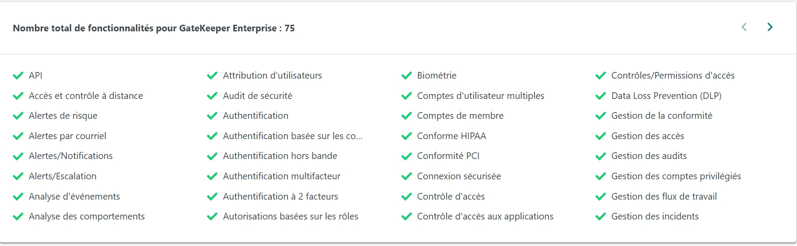
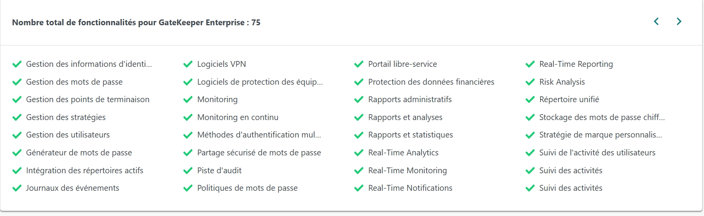
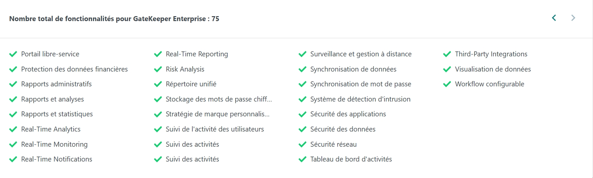
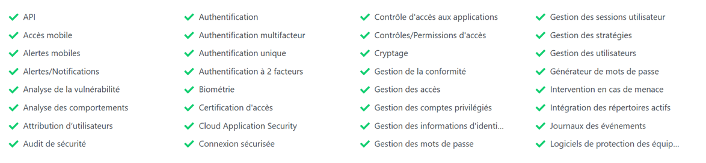
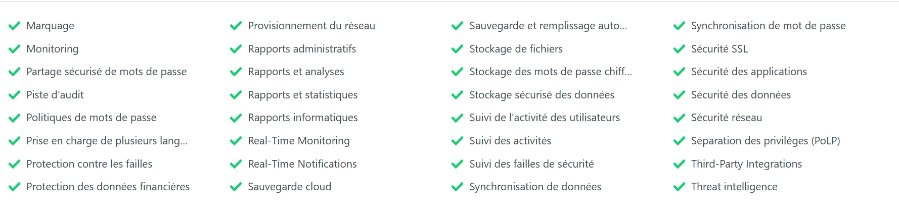
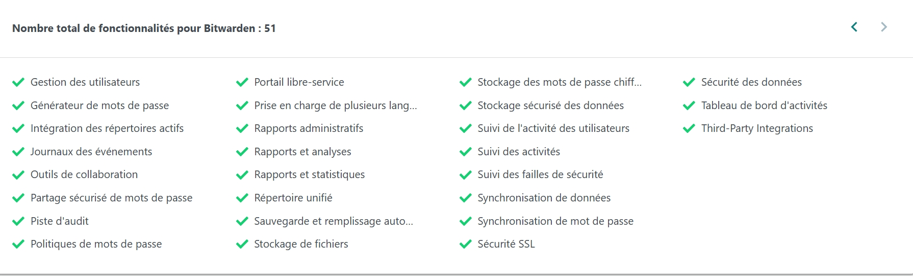
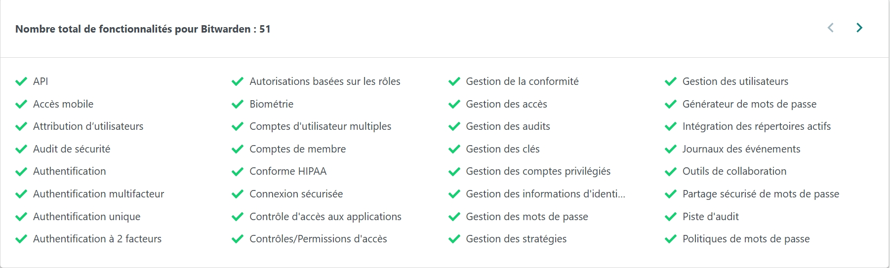

# Choix d'un gestionnaire de mot de passe

## GateKeeper Enterprise 5:30

Tarif : 3,00$us/mois.

La solution permet aux entreprises d'automatiquement verrouiller les appareils laissés sans surveillance des employés, de stocker les mots de passe de manière sécurisée et de fournir plusieurs options de connexion en fonction des préférences de l'utilisateur.

Déploiement sur le nuage, sur site

Clients typiques:
Travailleurs autonomes
Petites entreprises
Moyennes entreprises 
Grandes entreprises
Disponible dans 6 langues

### Bugs d'il y a 1 an :

Avec un appareil Apple, lorsque l'image s'ouvre avec le mode preview, il y a une erreur disant qu'apple ne peut pas vérifier si le fichier est sécuritaire

## Keeper Security 4,7:507

Combinaison de cryptage: PBKDF2 et AES 256 bits
utilisé: navigateur web, les ordinateurs, les tablettes et les smartphones. 
Encryption et décryption se font sur l'appareil au lieu dans le cloud ou sur des serveurs de Keeper.
Authentification à deux facteurs possible, ainsi que Keeper DNA: une solution qui utilise des montres intelligentes et d'autres dispositifs personneles pour confirmer l'identité de l'utilisateur.
le contrôle du partage des informations d'identification et la rotation planifiée des mots de passe.
Il possède une version gratuite ainsi qu'une version payante.
Les travailleurs autonomes ne font pas partie des clients visés
Clients visés:
Petite entreprises 2 à 50 employés
Moyenne entreprise 51 à 500 employés
Grandes entreprises 500 employés minimum

### Bugs d'il y a 7 mois : 

Pour une entreprise qui fait usage de keeper security, il arrive que le gestionnaire de mot de passe confond deux employés et donne à l'un les mot de passe de l'autre.

## Bitwarden 4,7:215

Tarif : ,00$ US/mois
Sur le cloud et le site
Chaque compte commence par la création d'un coffre fort personnel crypté de bout en bout qui permet à l'utilisateur de stocker ses propres informations d'identification personnelles.
Disponible dans près de 40 langues
Pas d'option gratuite 
Version d'essai gratuite
abonnement
clients typiques:
Travailleurs autonomes
Petites entreprises
Moyennes entreprises 
Grandes entreprises

### Bugs d'il y a 9 mois : 

L'application sur ordi demande toujours de faire des mise à jour même si c'est déjà fait.
Les paramètres ne sont pas sauvegardés lorsqu'on change d'appareils.
Il ne reconnait pas les champs texts.
L'autocomplétion ne fonctionne pas.

source1 : https://fr.getapp.ca/directory/677/password-manager/software
source2 : https://www.reddit.com/r/Bitwarden/comments/1nklbsc/bitwarden_bugs_with_account_settings_login_fields/
source3 : https://www.reddit.com/r/msp/comments/1ope6w9/massive_security_issues_discovered_with_keeper/
source4 : https://www.reddit.com/r/MacOS/comments/1hy8wot/gatekeeper_bug_when_changing_default_app_on_image/